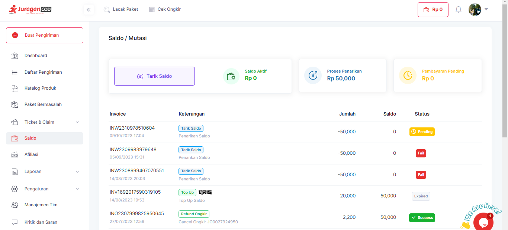
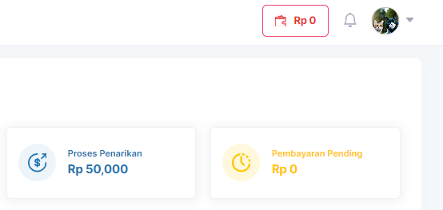

# Mengecek Saldo

!> User perlu **login** ke dalam **akun JuraganCOD** terlebih dahulu.

Langkah-langkah untuk mengecek saldo:

1. Klik <b>Saldo</b> pada Menu Bar

atau klik Icon Dompet dengan total saldo anda di pojok kanan atas

2. Halaman akan menampilkan informasi Saldo Aktif dan Mutasi anda. 

Terdapat informasi lengkap saldo seperti Nomor Invoice, Jumlah Transaksi, Saldo, serta Keterangan transaksi yang dilakukan.

### Melalui POSTMAN

Anda dapat mengecek saldo dengan melakukan GET pada API <b>saldo</b>.