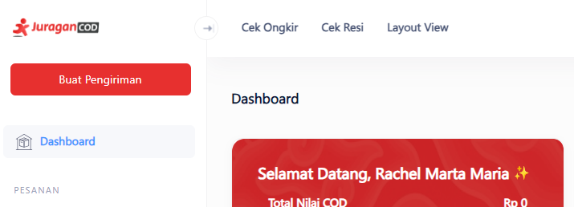
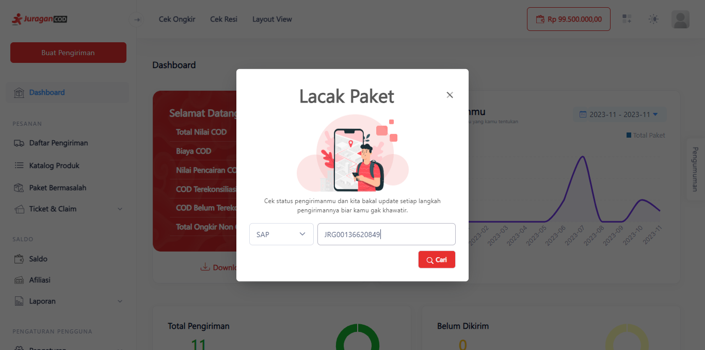
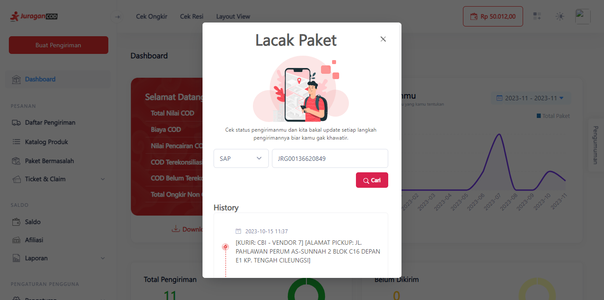

# Mengecek Resi

Dengan fitur ini anda dapat mengecek data perjalanan dari Resi anda.

> Tahap melakukan Cek Resi:

1. **Klik Cek Resi Pada Navbar**

Klik menu <b>Cek Resi</b> yang terletak pada sebelah kiri atas Navigation Bar JuraganCOD.

2. **Lacak Paket Anda**

Selanjutnya akan muncul modal yang harus anda isi, yaitu Ekspedisi dan Nomor Resi anda. Pastikan data yang terisi sudah benar dan sesuai, lalu klik tombol <b>Cari</b>.

3. **Status Pengiriman**

Jika benar, maka nomor resi akan menampilkan status pengiriman dan informasi perjalanan paket anda.

