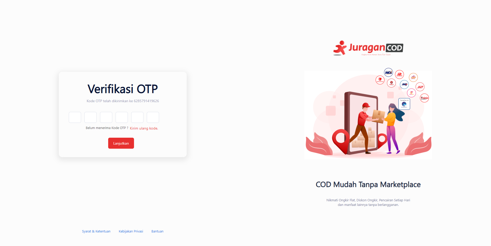

# Forgot Password

Anda dapat melakukan reset atau ubah kata sandi menggunakan fitur <b>Lupa Password</b>

1. Saat mengisi form Login, klik "Lupa Password" di bawah kolom Password


2. Pada halaman <b>Lupa Password</b>, isi dengan No. Whatsapp atau Email yang terdaftar pada akun anda


3. Masukkan kode OTP yang telah dikirim ke No. Whatsapp atau Email anda


4. Setelah berhasil anda dapat membuat Kata Sandi baru pada form Set Password Baru


### Menggunakan Postman

Anda dapat mengubah password dengan melakukan POST pada API <b>forgot-password</b> dengan contoh JSON body sebagai berikut:
```
{
    "email": "dhifta48@gmail.com"
}
```
Anda akan mendapat response kode OTP yang dapat di POST pada API <b>verification-otp</b> dengan JSON body sebagai berikut:
```
{
    "otp": 108268,
    "phone_number": "dhifta48@gmail.com"
}
```
Setelah itu anda dapat melakukan ubah password pada API <b>change-forgot-password</b> dengan POST JSON body seperti berikut: 
```
{
    "verification": "dhifta48@gmail.com",
    "new_password": "123456",
    "confirm_password": "123456"
}
```