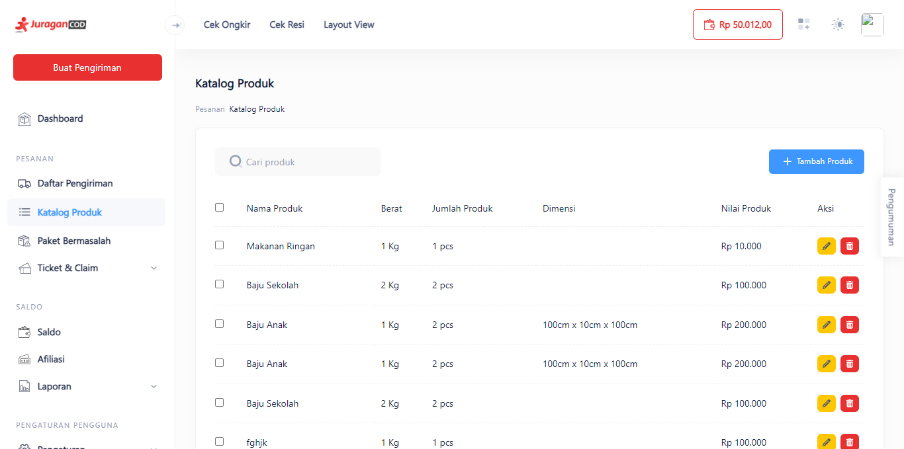
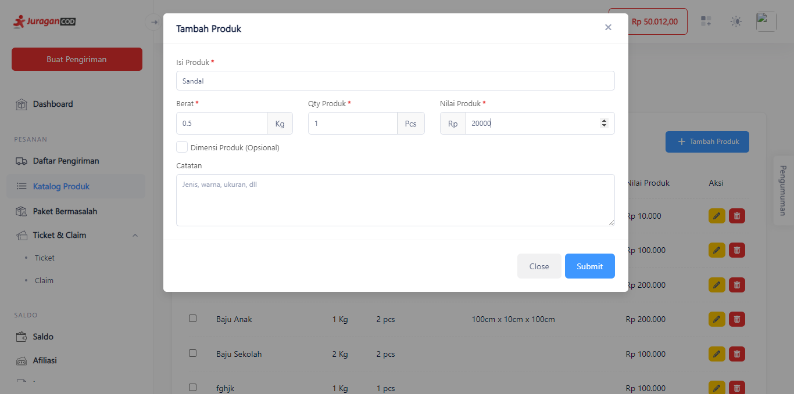
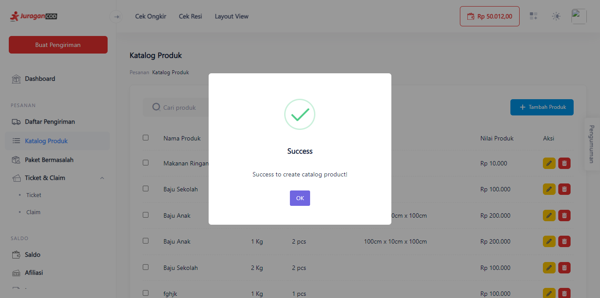
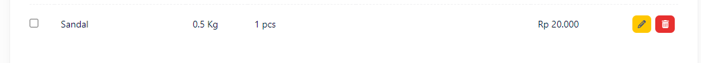
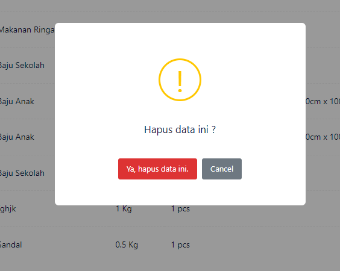

# Manajemen Katalog Produk

Dengan fitur ini anda dapat membuat, mengedit, dan menghapus produk anda.

> Tahap melakukan manajemen katalog produk:

1. **Klik Katalog Produk pada Menu Sidebar**

Anda akan diarahkan ke Halaman Katalog Produk, jika belum memiliki produk maka anda dapat menambahkannya dengan klik tombol <b>+Tambah Produk</b>.

2. **Isi Data Produk Anda**

Terdapat modal yang berisi form untuk anda isi berupa data produk, mulai dari jenis, berat, kuantitas, nilai produk, dan keterangan produk anda.

Pastikan semua kolom telah terisi, lalu klik <b>Submit</b> untuk menyimpan produk.

3. **Edit atau Hapus Produk**

Anda dapat melakukan perubahan pada produk anda, dengan mengedit atau menghapus. 
Untuk mengedit produk tekan tombol berwarna kuning dengan <b>ikon pencil</b> di sebalah kanan produk. Untuk menghapus produk tekan tombol berwarna merah dengan <b>ikon kotak sampah</b>.

Saat menghapus produk, akan muncul pop up alert untuk memastikan apakah anda yakin akan menghapus produk tersebut, jika ya, tekan tombol <b>Ya, hapus data ini.</b>

