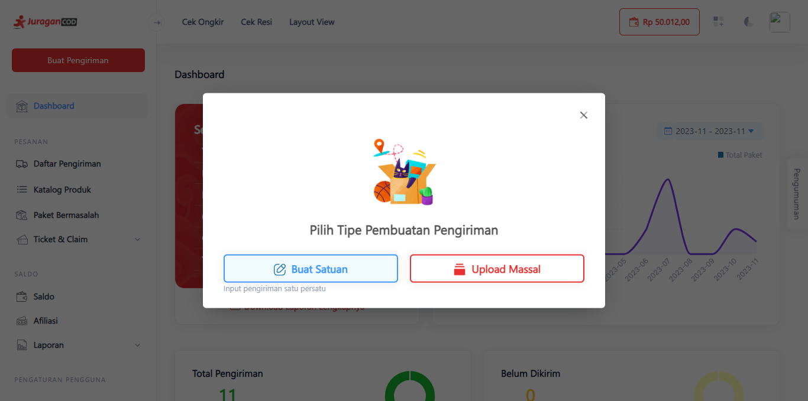

# Membuat Pengiriman Satuan

Dengan fitur ini anda dapat membuat transaksi pengiriman barang secara satuan pada satu tujuan pengiriman.

> Tahap melakukan pengiriman satuan:

1. **Klik Tombol Buat Pengiriman**

Klik tombol <b>Buat Pengiriman</b> yang terdapat di kiri atas dashboard JuraganCOD. 

2. **Pilih Tombol Buat Satuan**

Terdapat pop up menu, pilih <b>Buat Satuan</b> untuk membuat pengiriman satuan.

3. **Pertama, Isi Data Pengiriman dan Penerima**

Anda perlu memasukkan data Pengirim dan Penerima paket. Pada data <b>Pengirim</b>, terdapat Jenis Penjemputan yaitu Pickup dan Dropoff yang dapat dipilih sesuai kebutuhan anda, terdapat juga pilihan Jam Pickup, serta Alamat Pengirim. Pada data <b>Penerima</b>, anda perlu memasukkan nama, nomor hp, serta alamat penerima.

4. **Kedua, Isi Detail Paket**

Anda dapat memasukkan detail informasi paket secara manual, maupun mencarinya dari Katalog Produk anda. Baca tutorial cara [Manajemen Katalog Produk](katalog.md)

5. **Ketiga, Pilih Jenis Transaksi dan Ekspedisi**

Terdapat 2 jenis transaksi yaitu COD dan Non-COD, dengan ekspedisi yang beragam dapat anda pilih sesuai kebutuhan.

6. **Terakhir, Asuransi dan Detail Rincian Biaya**

Anda dapat memilih untuk mengasuransikan paket atau tidak, ini merupakan opsional, begitu juga dengan Custom COD. Terdapat detail Rincian Biaya berdasarkan jarak pengiriman ke penerima, bobot barang, serta biaya tambahan lainnya yang telah dijelaskan secara rinci dan jelas.

Setelah selesai, tekan tombol <b>Proses</b> untuk memproses pengiriman paket anda.

7. **Proses Pengiriman**

Konfirmasi pesanan anda dengan menekan tombol <b>Ya, Proses</b>.

Selamat, pengiriman berhasil diproses.

