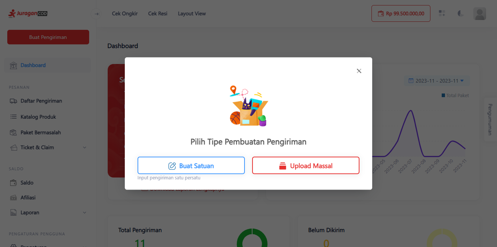
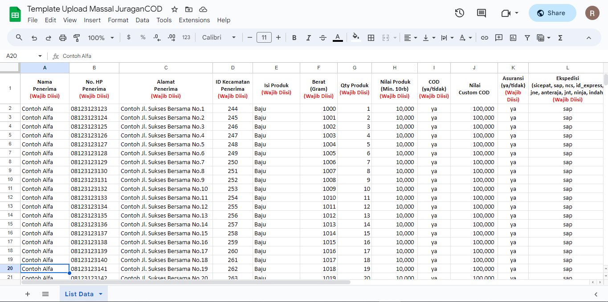
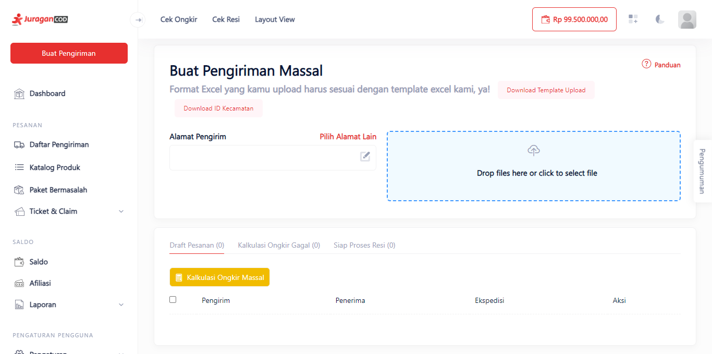
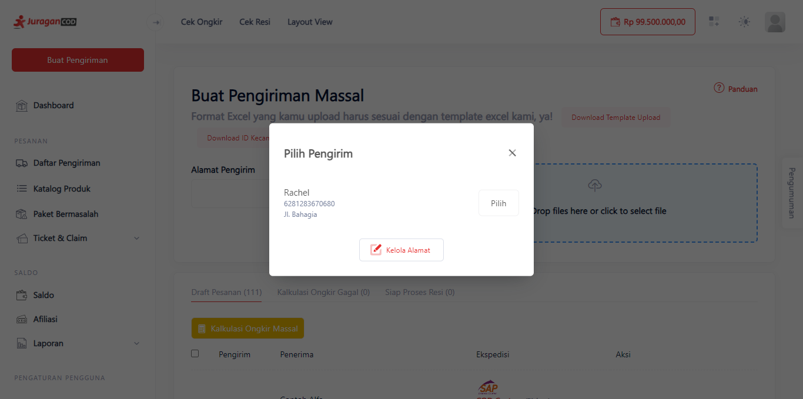
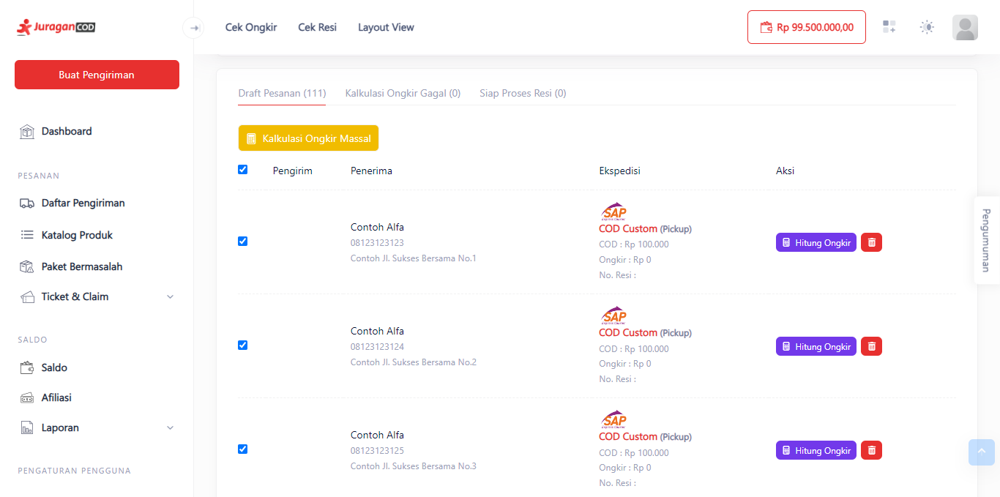

# Membuat Pengiriman Massal

Dengan fitur ini anda dapat membuat transaksi pengiriman barang secara satuan pada satu tujuan pengiriman.

> Tahap melakukan pengiriman massal:

1. **Klik Tombol Buat Pengiriman**

Klik tombol <b>Buat Pengiriman</b> yang terdapat di kiri atas dashboard JuraganCOD. 

2. **Pilih Tombol Upload Massal**

Terdapat pop up menu, pilih <b>Upload Massal</b> untuk membuat pengiriman secara massal.

3. **Pertama, Unduh Template Upload**

Anda kini berada di Halaman Pengiriman Massal, klik tombol <b>Download Template Upload</b> untuk mengunduh template yang akan diisi data pengiriman massal anda.

Isi Data Pengiriman dengan benar dan sesuai kolom yang diberikan untuk mencegah kegagalan pengiriman massal.

4. **Kedua, Unggah Dokumen Template Upload Massal**

Setelah selesai membuat dokumen upload massal berupa file excel atau csv, upload file tersebut pada menu unggah <b>Drop files here or click to select file</b>. Tunggu beberapa saat sampai produk berhasil terinput.

5. **Kedua, Pilih Alamat Pengirim**

Jika pilihan masih kosong, klik <b>Kelola Alamat</b> yang akan dialihkan ke tab baru, buat alamat pengiriman pada halaman tersebut. Jika selesai, kembali ke halaman Pengiriman Massal lalu refresh. Pilih alamat yang tersedia.

6. **Ketiga, Pilih Produk Secara Massal**

Centang produk yang akan anda kirim secara massal, klik <b>Kalkulasi Ongkir Massal</b>.

