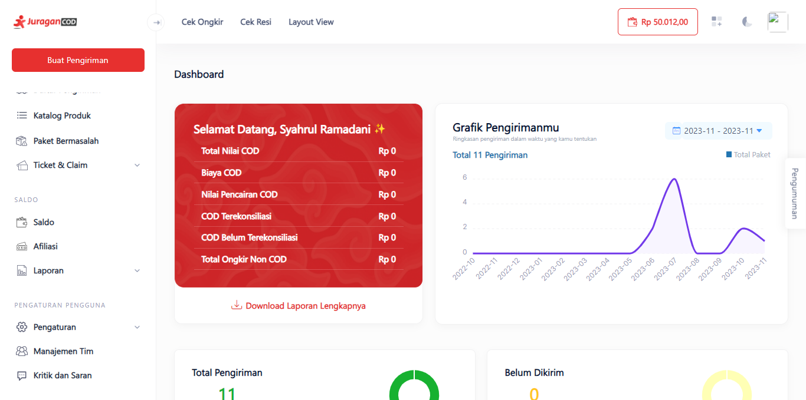
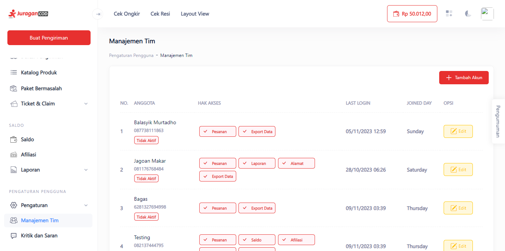
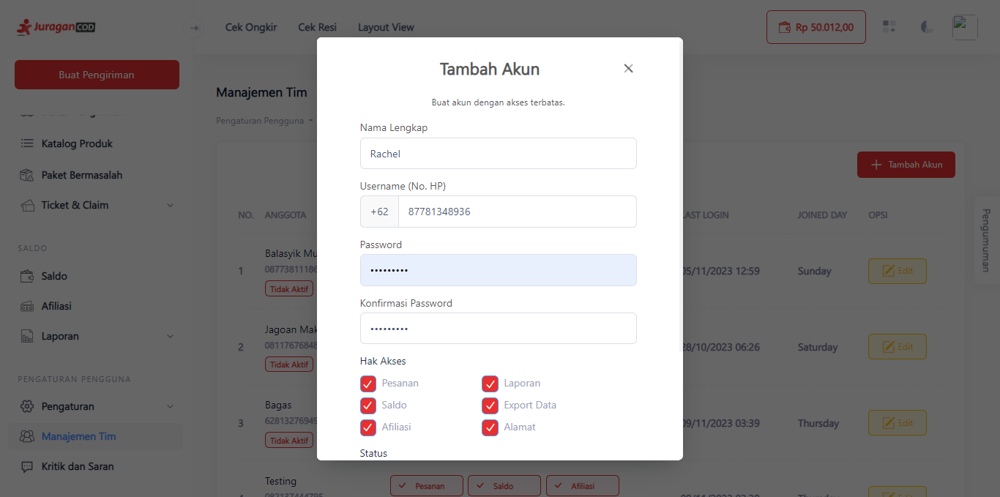
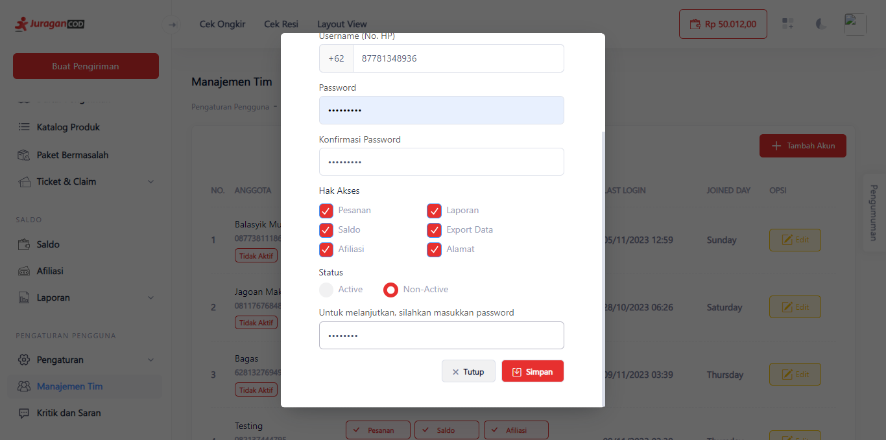
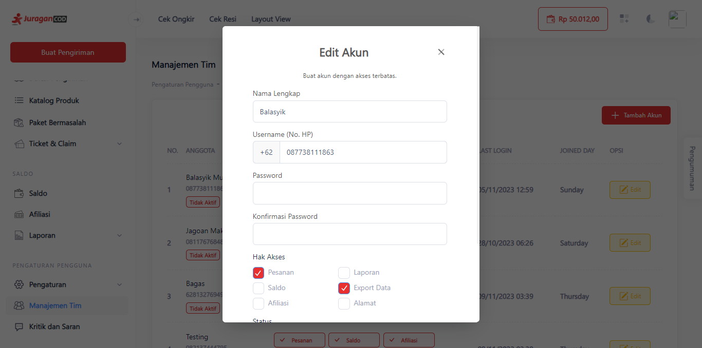
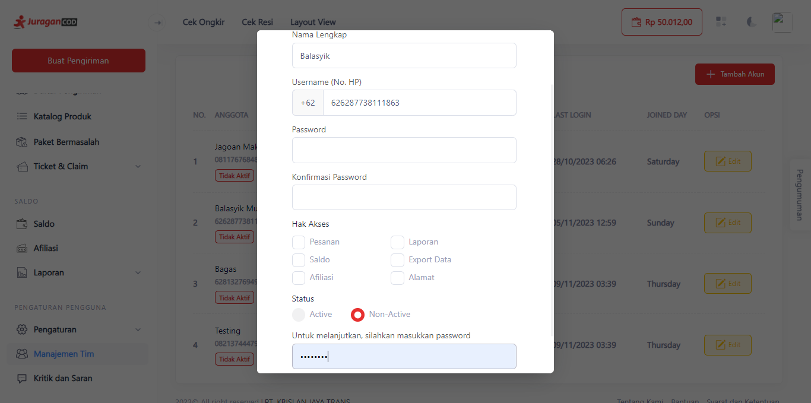
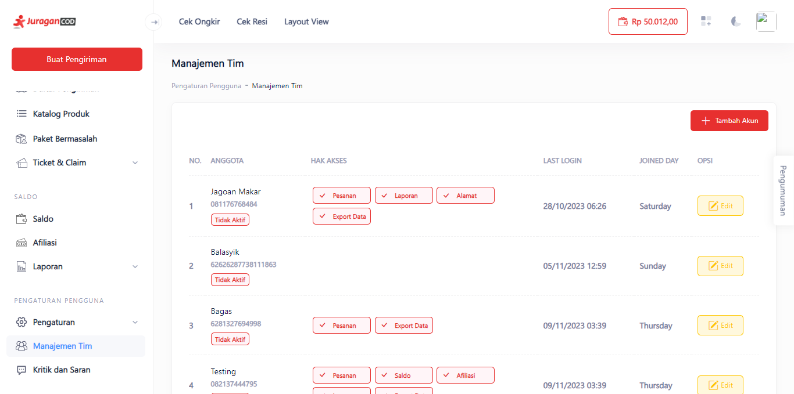

# Manajemen Member Tim Akun

Dengan fitur ini anda dapat menambahkan member yang dapat membantu anda mengatur penjualan, kita dapat mengatur fungsi dari member tersebut tanpa harus mengakses semua fitur yang kita miliki.

> Tahap melakukan manajemen member akun:

1. **Klik Menu Manajemen Tim**

Pada Sidebar JuraganCOD, klik menu <b>Manajemen Tim</b> pada pojok kiri bawah.

2. **Halaman Manajemen Tim**

Pada halaman ini terdapat daftar member yang terhubung dengan akun anda, anda dapat menambahkan, mengedit, dan membatasi akses member.

Untuk menambahkan member, klik tombol <b>+Tambah Akun</b>.

3. **Tambah Akun Tim**

Anda dapat membuat akun baru melalui fitur ini, masukkan identitas akun baru anda, seperti Nama Lengkap, Username (No. HP), dan Password.

Anda dapat memberi Hak Akses bagi akun baru anda, dan Status akun apakah akan Aktif atau Non-Aktif.

4. **Edit Akun Tim**

Anda dapat mengubah informasi akun Tim, juga mengubah Hak Akses akun.

5. **Hapus Semua Akses Akun Tim**

Jika akun tersebut tidak ingin anda beri akses ke fitur apapun, anda dapat menghapusnya seperti berikut.

6. **Manajemen Tim dan Hak Akses**

Pada Halaman Manajemen Tim dapat dilihat, terdapat akun member tim yang tidak memiliki akses apapun, artinya akun tersebut tidak dapat mengakses fitur seperti Pesanan, Saldo, Laporan, dan sebagainya dari akun utama anda.

