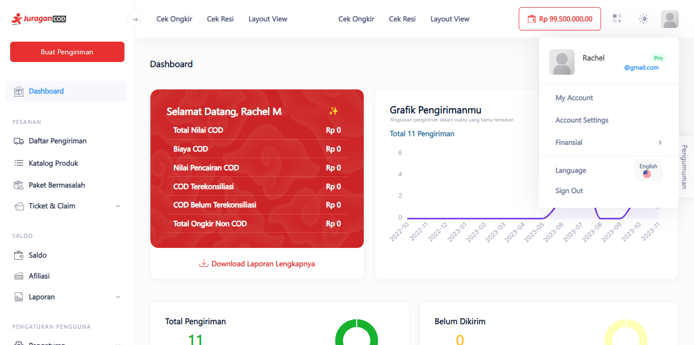
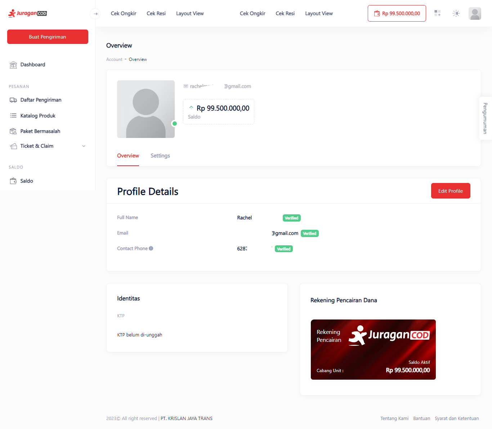
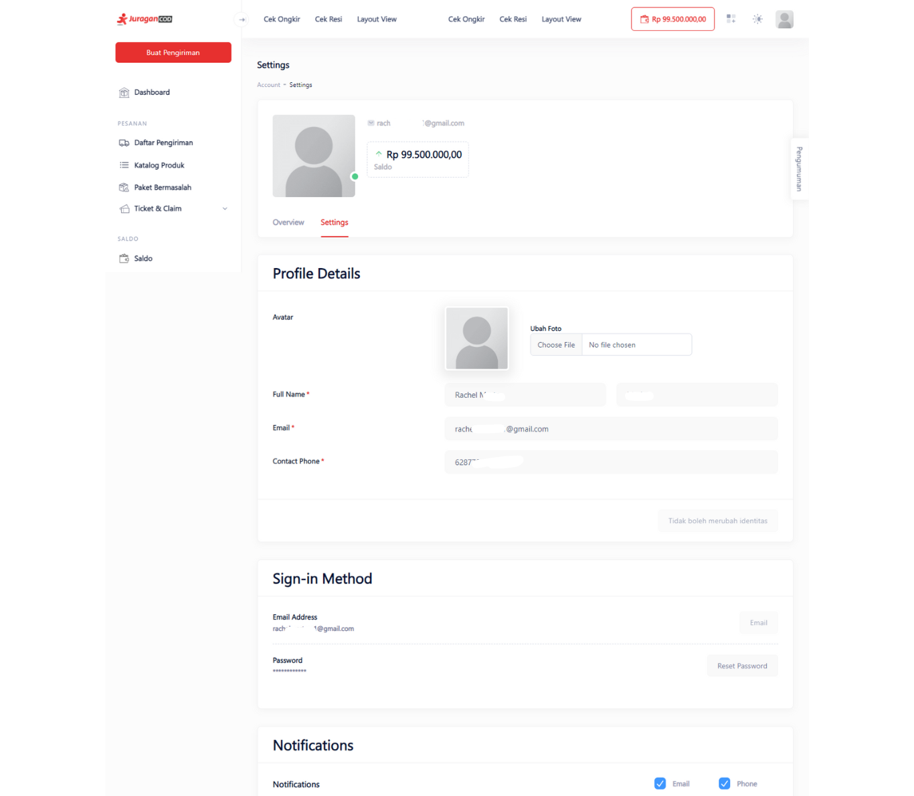
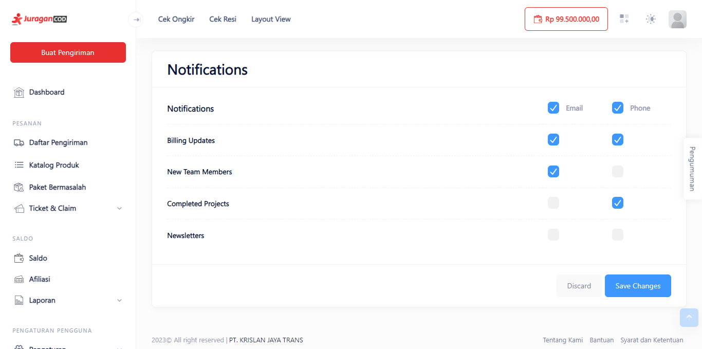

# Manajemen Profil Akun

Dengan fitur ini anda dapat mengubah dan mempersonalisasi akun anda, seperti mengubah nama, email, dan nomor HP.

> Tahap melakukan manajemen profile akun:

1. **Klik Icon Avatar**

Pada Dashboard JuraganCOD, klik ikon avatar pada pojok kanan atas yang akan menampilkan menu bar, klik <b>My Account</b> untuk melihat profil akun anda sebelum mengeditnya.

  

2. **Halaman Overview**

Anda akan diarahkan pada halaman Overview dan Profile Details anda, yang berisi informasi mengenai Full Name, Email, dan Contact Phone.

Klik tombol <b>Edit Profile</b> untuk mengedit akun anda.

3. **Halaman Edit Profil Akun**

Pada halaman ini, anda dapat mengubah detail informasi akun serta foto profil anda. Anda juga dapat mengubah kata sandi akun dan pengaturan notifikasi anda.

4. **Simpan Profil Baru Akun**

Setelah anda mengubah profil, simpan perubahan dengan klik tombol <b>Save Changes</b>.

