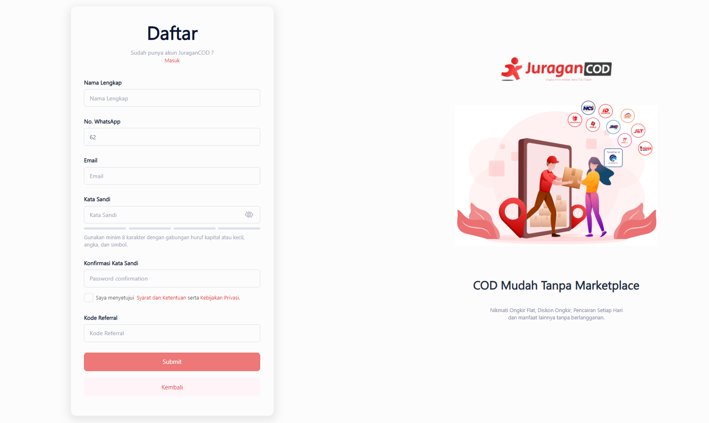
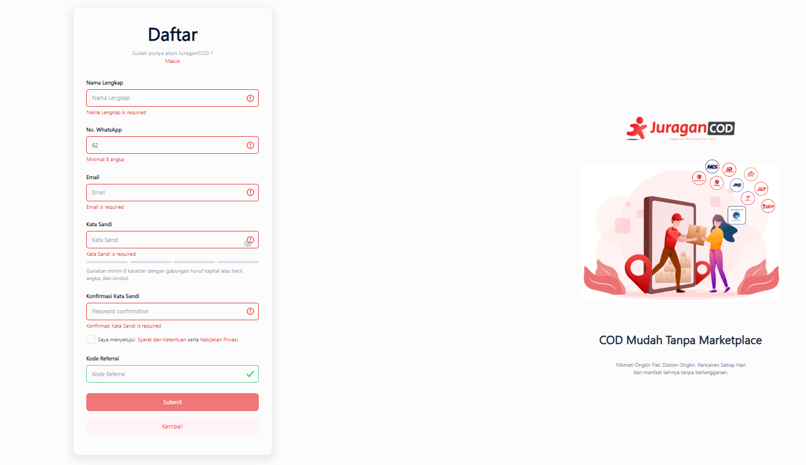
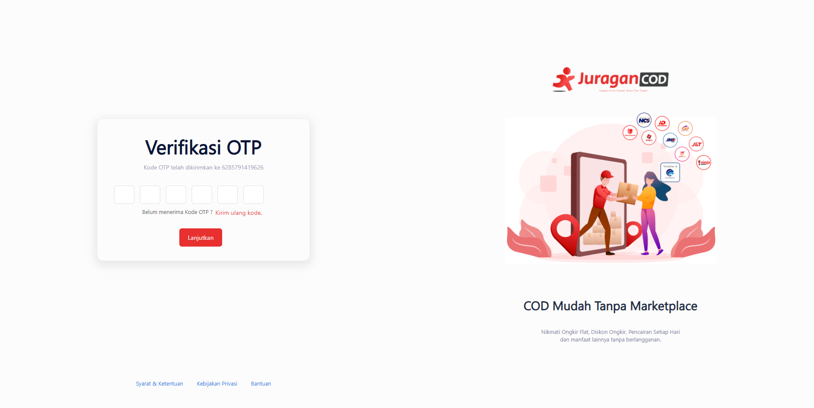

# Daftar Akun

> Tahap melakukan registrasi akun:
>1. Mengisi form register
>2. Verifikasi nomor Whatsapp
>3. Verifikasi email


1. **Mengisi form register**


- Silahkan akses <b>JuraganCOD.com</b>
- Klik <b>Daftar</b>
- Isi form pendaftaran <br>
Contoh data JSON untuk dikirim melalui API <b><i>register-seller</i></b>:
```
{
    "fullname": "M Dhifta",
    "email": "dhifta48@gmail.com",
    "password": "123456",
    "phone_number":"6285791419626",
    "code_referal": ""
}
```

!> Hal yang perlu diperhatikan: <br>

** Semua kolom kecuali `Kode Referral` <b>wajib</b> diisi. <br>
** `No. Whatsapp` minimal berisi 8 angka. <br>
** `Kata Sandi` minimal 8 angka dengan gabungan huruf kapital atau kecil, angka, dan simbol.

Setelah form berhasil dikirim dengan kriteria data yang sesuai, maka akan dialihkan ke halaman Verifikasi OTP.

2. Verifikasi nomor Whatsapp
Tombol <b>Submit</b> pada form registrasi akan mentrigger API <b><i>send-whatsapp-api</i></b> yang mengirimkan OTP ke nomor Whatsapp yang telah anda input. <br>


- Cek kode OTP yang dikirim pada nomor Whatsapp anda. <br>
Apabila belum menerima kode, maka lakukan <b>Kirim ulang kode.</b> <br>
Apabila kode OTP telah muncul maka masukkan kode tersebut pada kolom yang tersedia. <br>

- Klik tombol <b>lanjutkan</b> yang akan mengirim data atau kode OTP ke API <b><i>verification-otp</i></b> <br>
Apabila kode yang dikirim salah, API akan merespon ```Upps, your email or number not found.``` maka anda dapat melakukan <b>Kirim ulang kode.</b> <br>
Apabila kode OTP yang dimasukkan benar, maka nomor Whatsapp anda berhasil terverifikasi.<br>
<!-- kayaknya responnya masih salah untuk yg kode OTP salah, harusnya Kode OTP Salah bukan email/no hp not found -->

3. Verifikasi email
Tombol <b>Lanjutkan</b> yang diklik dan berhasil memverifikasi nomor Whatsapp pada tahap sebelumnya, akan memuat halaman Verifikasi Email sekaligus mentrigger API <b><i>verification-email</i></b> yang otomatis mengirimkan email verification ke alamat email anda.

- Cek email anda yang telah dikirim <i>email verification</i>
- Klik pada tombol atau link yang diarahkan pada email untuk memverifikasi email anda. <br>
Apabila gagal memverifikasi, anda dapat meminta untuk melakukan <b>Kirim ulang email</b>. <br>
Apabila email berhasil terverifikasi, maka anda akan langsung diarahkan ke <b>Halaman Dashboard</b>.
