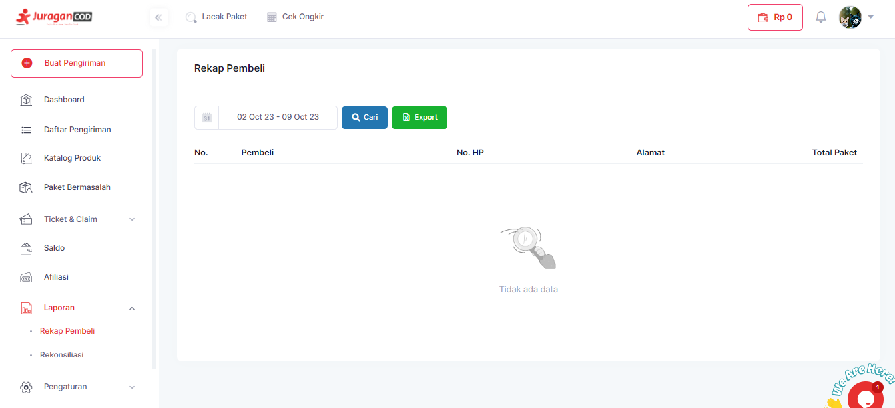
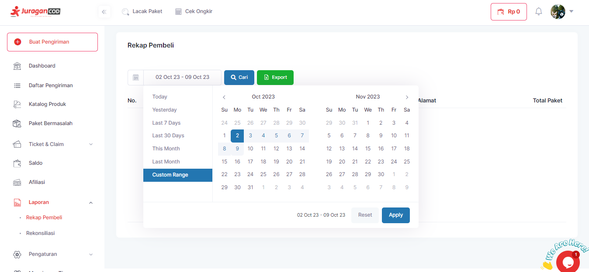

# Rekap Pembelian

!> User perlu **login** ke dalam **akun JuraganCOD** terlebih dahulu.

Langkah-langkah untuk melihat Rekap Pembelian antara lain:

1. Klik Laporan pada Menu Bar, lalu pilih dropdown <b>Rekap Pembeli</b>

2. Secara default, Rekap Pembeli akan menampilkan laporan pembelian dalam satu pekan. Anda dapat memilih laporan sesuai kebutuhan, baik harian, mingguan, atau bulanan.

3. Klik tombol <b>Cari</b> untuk menampilkan Rekap Pembelian
4. Terdapat fitur Export untuk mengunduh file laporan anda dalam bentuk excel dengan menekan tombol <b>Export</b>.

### Melalui POSTMAN

Anda dapat menampilkan laporan atau rekap pembelian anda melalui API dengan melakukan GET pada API <b>rekap-pembelian</b> dan <b>rekap-pembelian-search</b>.