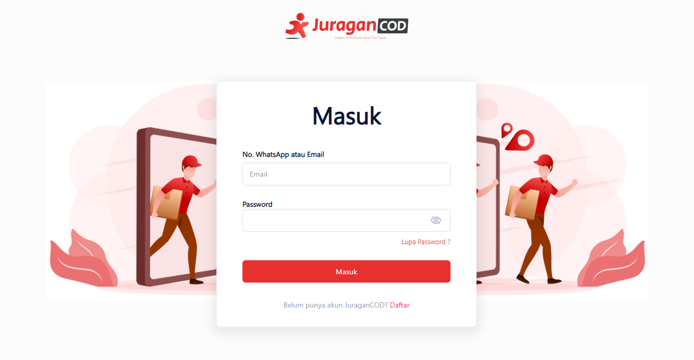

# Cara Masuk Akun di JuraganCOD.com
Pada halaman login, anda hanya perlu melakukan input <b>Email atau No Telfon</b> dan <b>Password</b> yang telah anda buat pada proses Registrasi Akun.<br>

## Mengisi data login

Contoh data JSON untuk dikirim melalui API <b><i>login</i></b>:
```
{
    "email": "hifisaputra1@gmail.com",
    "password": "123456"    
}
```

Apabila data yang dimasukkan sesuai dengan akun yang ada pada database, maka API <b><i>login</i></b> akan merespon sebagai berikut yang artinya anda berhasil login dan otomatis diarahkan ke <b>Halaman Dashboard</b>:
```
```
Apabila gagal melakukan login, maka API akan merespon sebagai berikut dan anda dapat mengulangi proses login yang sama:
```
```