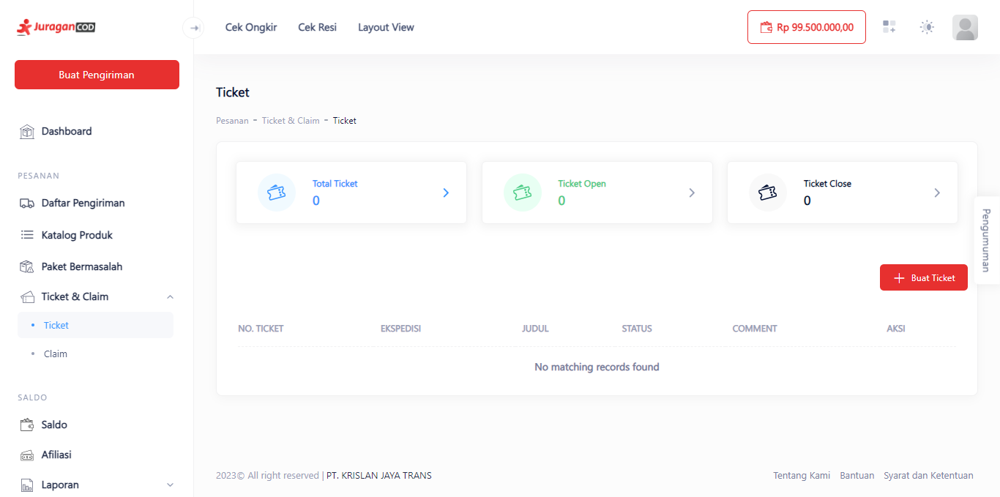
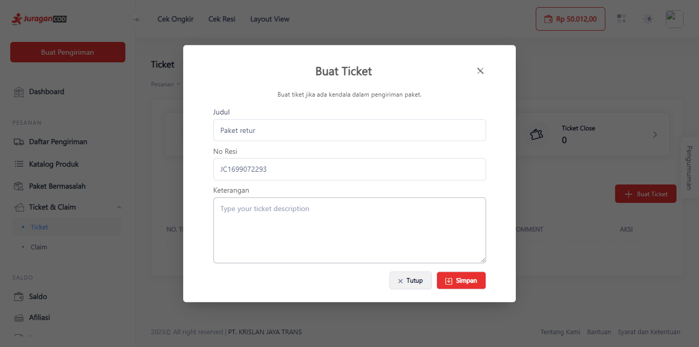
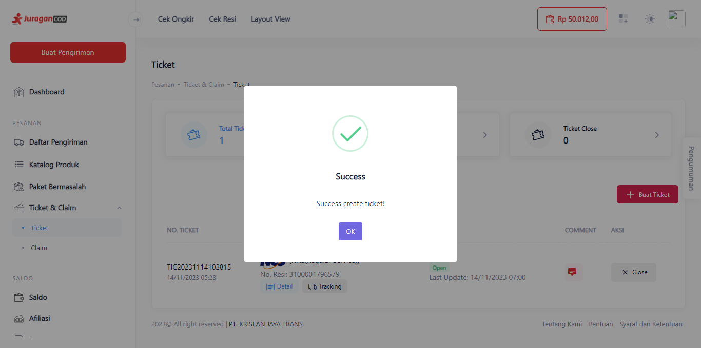

# Tiket dan Claim

Fitur ini memungkinkan anda untuk membuat tiket yang dapat diklaim saat terjadi kesalahan atau kerusakan pada pengiriman.

> Tahap melakukan Tiket dan Claim:

1. **Klik Menu Ticket & Claim di Sidebar**

Pada menu tersebut ditampilkan Ticket yang anda buat, jika belum ada maka anda dapat membuatnya dengan menekan tombol <b>+Buat Ticket</b>.

2. **Isi Informasi Paket dan Keterangan Kendala**

Isikan sesuai paket yang berkendala, jelaskan kendala anda pada kolom Keterangan. Jika selesai, anda dapat menyimpannya dengan klik tombol <b>Simpan</b>.

3. **Ticket Berhasil Dibuat**

Jika muncul keterangan Success, maka ticket berhasil dibuat dan anda dapat melakukan claim.
