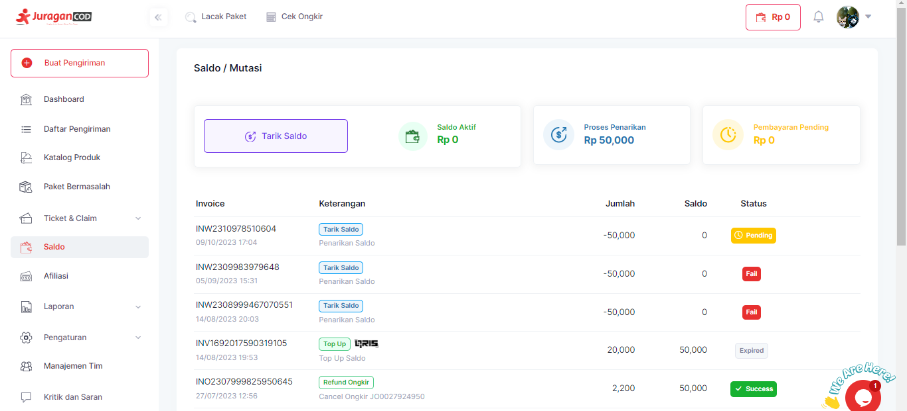

# Penarikan Saldo

!> User perlu **login** ke dalam **akun JuraganCOD** terlebih dahulu.

Langkah-langkah untuk melakukan tarik saldo:

1. Klik <b>Saldo</b> pada Menu Bar



2. Halaman akan menampilkan informasi Saldo atau Mutasi. Klik tombol <b>Tarik Saldo</b> untuk melakukan tarik saldo ke rekening anda.

3. Terdapat form Tarik Tunai yang harus anda isi, yaitu <b>Jumlah Penarikan</b> yang akan anda tarik.


Klik <b>Lanjutkan</b>. 

Pastikan Saldo anda mencukupi untuk minimal tarik saldo yaitu 50.000, apabila berhasil maka saldo akan masuk ke nomor rekening anda.

### Melalui POSTMAN

Anda dapat melakukan POST pada API <b>withdraw</b> dengan JSON body sebagai berikut:
```
{
    "jumlah": 10000
}
```